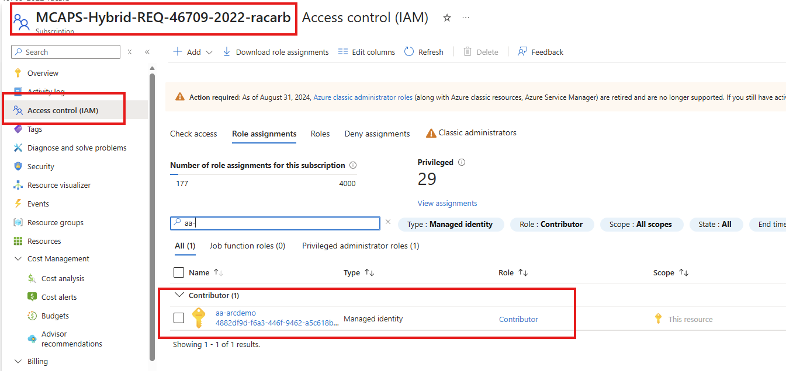
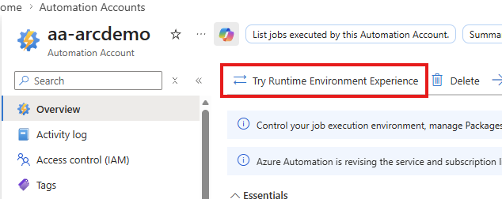
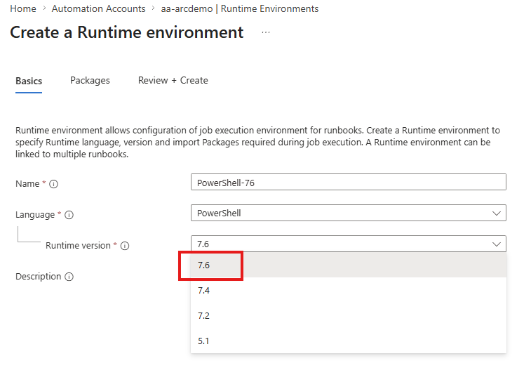
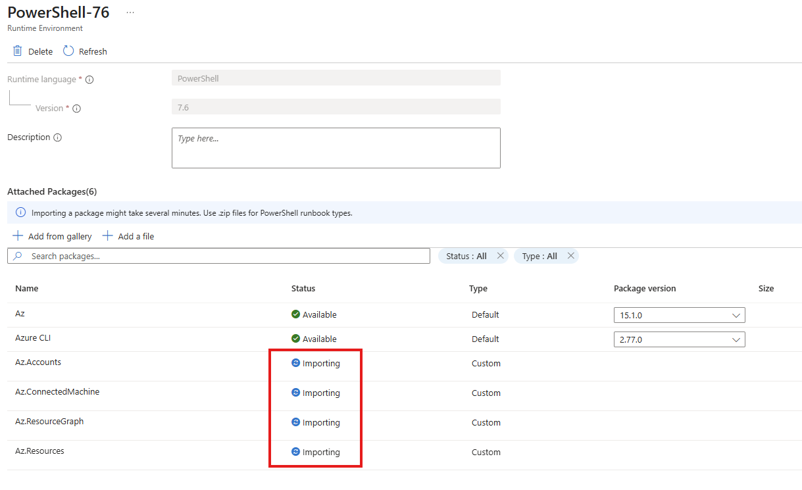
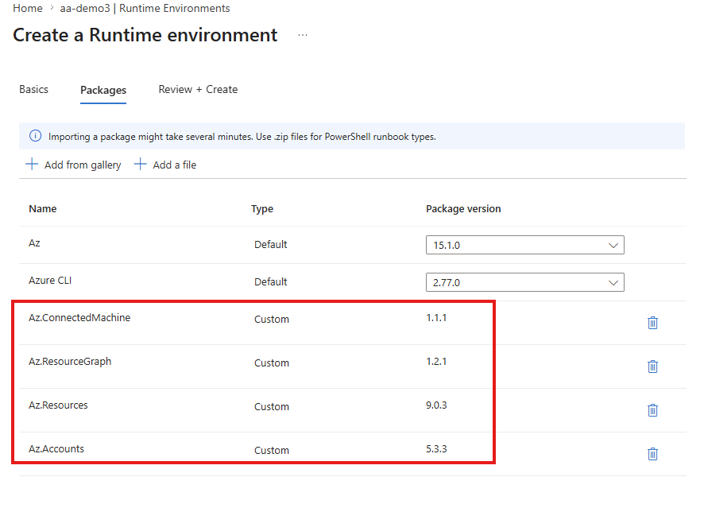
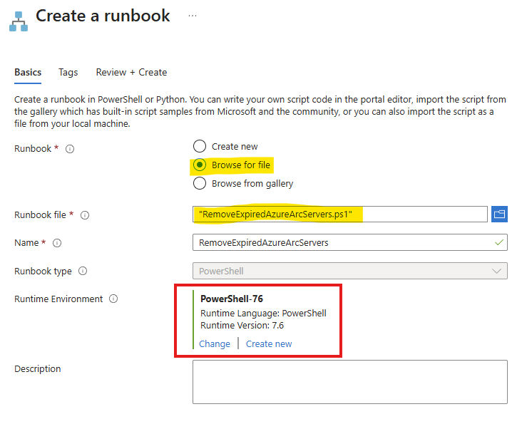

# Remove Expired Azure Arc Servers Runbook

This PowerShell runbook automatically removes expired Azure Arc-enabled servers that are tagged for decommissioning. It runs in an Azure Automation Account using a system-assigned managed identity.

## What This Script Does

1. Connects to Azure using managed identity
2. Queries Azure Resource Graph for servers that are **both** expired AND tagged with `Decommissioned: True`
3. Removes the identified servers from Azure Arc

## Setup Instructions

### 1. Create an Automation Account

1. In the [Azure portal](https://portal.azure.com), create a new Automation Account
2. Enable **System assigned managed identity** on the Advanced tab


[Learn more](https://learn.microsoft.com/en-us/azure/automation/quickstarts/create-azure-automation-account-portal)

### 2. Assign Permissions to the Managed Identity

Grant the necesary permisions to the Automation Account's managed identity at the subscription or resource group level.



[Learn more about Azure Arc roles](https://learn.microsoft.com/en-us/azure/azure-arc/servers/security-permissions)

### 3. Create a Runtime Environment

1. In the Automation Account, switch to the Runtime Environment experience
2. Go to **Runtime Environments** > **Create** 
3. Select **PowerShell 7.6** as the runtime version






### 4. Import Required Modules

Add these modules to the runtime environment:
1. `Az.Accounts`
2. `Az.ConnectedMachine`
3. `Az.Resources`
4. `Az.ResourceGraph`







[Learn more about modules](https://learn.microsoft.com/en-us/azure/automation/shared-resources/modules)

### 5. Create and Configure the Runbook

1. Create a new PowerShell runbook named `RemoveExpiredAzureArcServers`
2. Select the runtime environment you created
3. Browse and select the script `RemoveExpiredAzureArcServers.ps1`
4. Save and publish




### 6. Test and Schedule

1. Test the runbook using the **Test pane**
2. Once verified, publish and link to a schedule if necesary (e.g., daily or weekly)


[Learn more about schedules](https://learn.microsoft.com/en-us/azure/automation/shared-resources/schedules)

## Configuration

Update these variables in the script:

```powershell
$TagName = "Decommissioned"          # Tag key
$TagValue = "True"                   # Tag value
$SubscriptionName = "YOUR-SUB-NAME"  # Your subscription
```

## Tagging Servers for Removal

Tag servers before they are removed:

**Portal**: Navigate to server > Tags > Add `Decommissioned: True`

**CLI**: 
```bash
az connectedmachine update --name <server> --resource-group <rg> --tags Decommissioned=True
```

**PowerShell**:
```powershell
Update-AzConnectedMachine -Name <server> -ResourceGroupName <rg> -Tag @{Decommissioned="True"}
```

## Monitoring

View execution history in **Runbooks** > **Jobs** to see detailed logs and results.

## Additional Resources

- [Azure Arc-enabled servers](https://learn.microsoft.com/en-us/azure/azure-arc/servers/overview)
- [Azure Automation](https://learn.microsoft.com/en-us/azure/automation/overview)
- [Azure Resource Graph](https://learn.microsoft.com/en-us/azure/governance/resource-graph/overview)
